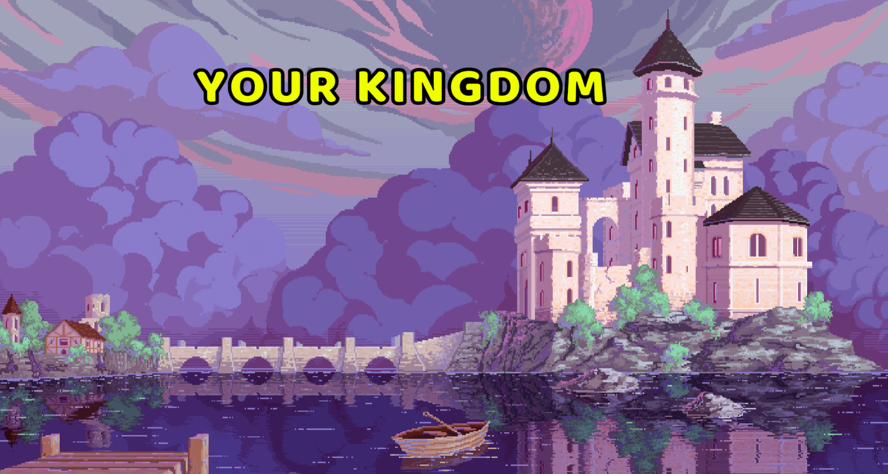
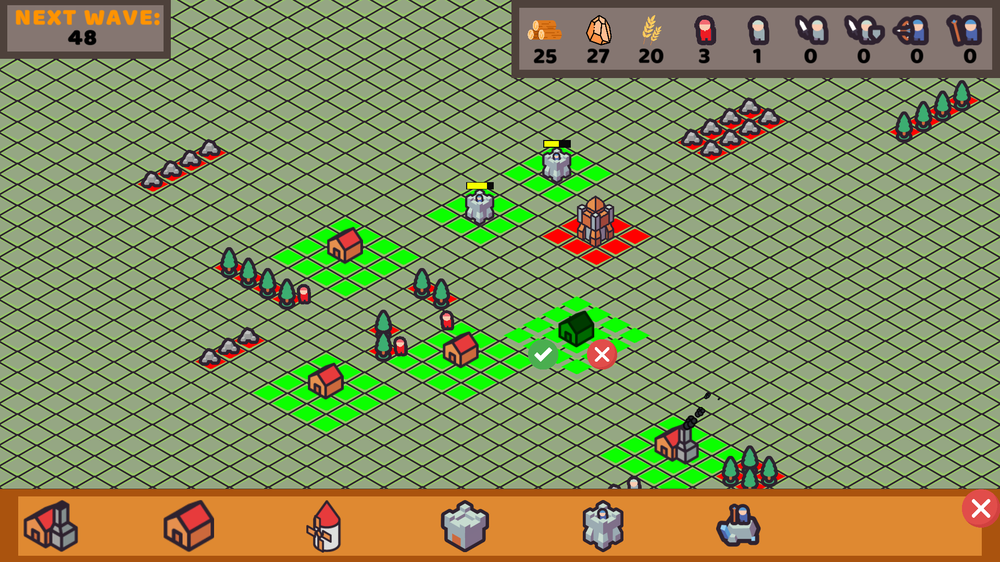
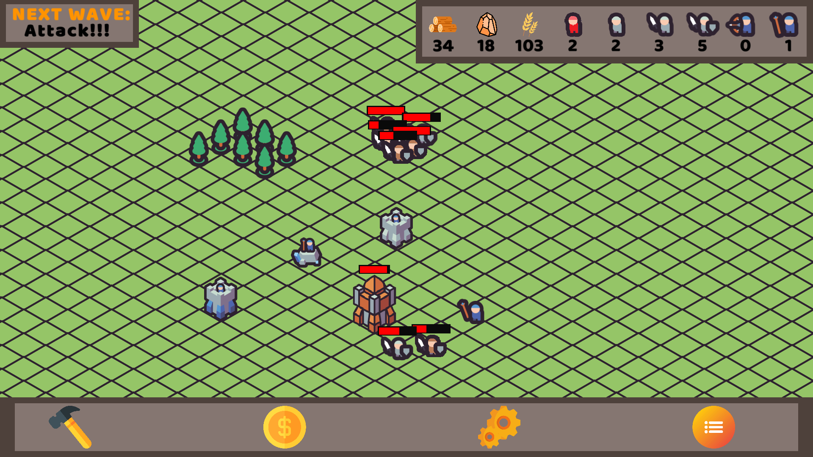
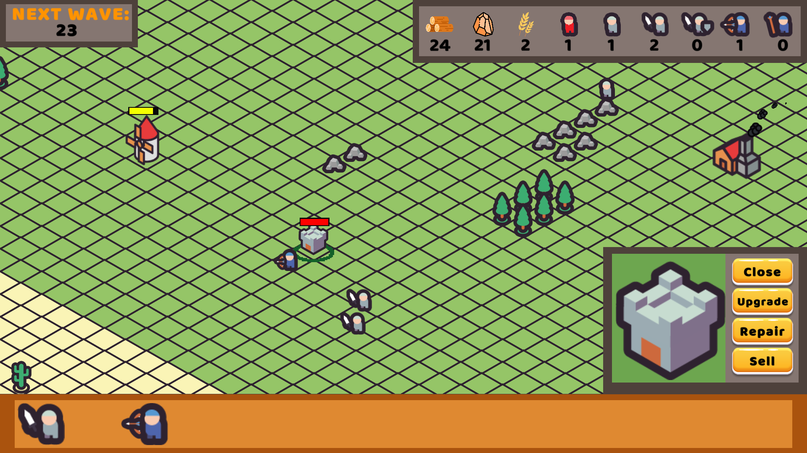

Your Kingdom is an immersive real-time strategy game that transports players to a medieval world where they must defend their castle from relentless barbarian attacks.

<b>Itch:<b> https://libertox.itch.io/your-kingdom  

# Main Features

## Building System
A key feature of Your Kingdom is the ability to construct buildings and structures that serve various purposes. 
  Players can establish resource-gathering structures such as mines, mills, and lumberhouse to ensure a steady supply of essential resources. Additionally, players can construct military buildings and defense towers.
  
  

## Simple Enemy AI
 The game uses a simple enemy AI system base on StateMachine that sends enemies to our kingdom from time to time.These enemies, such as barbarians, would act threat to your kingdom, launching attacks on your defenses.
  
    
  
  ## Recruit and Control Units
 The game allows players to recruit and control units like knight, archer, wizard. Each of them has different stats.
  
    
